# Solana 交易生命周期详解

## 目录
1. [Solana交易生命周期概述](#1-solana交易生命周期概述)
2. [交易生命周期流程图](#2-交易生命周期流程图)
3. [各阶段详细说明](#3-各阶段详细说明)
4. [关键组件分析](#4-关键组件分析)
5. [代码实现示例](#5-代码实现示例)

---

## 1. Solana交易生命周期概述

Solana交易生命周期是指从交易创建到最终确认的完整过程。这个过程涉及多个组件的协作，包括客户端、RPC节点、验证者网络等。

### 1.1 核心特点
- **高吞吐量**: 每秒可处理数万笔交易
- **低延迟**: 交易确认时间通常在400-800毫秒
- **并行处理**: 通过Sealevel运行时实现并行执行
- **确定性**: 基于Proof of History (PoH) 的时间排序

---

## 2. 交易生命周期流程图

### 2.1 完整流程图

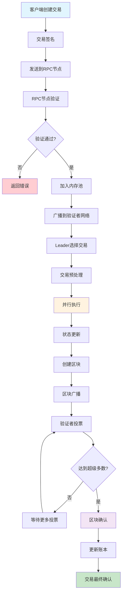

### 2.2 详细阶段流程图

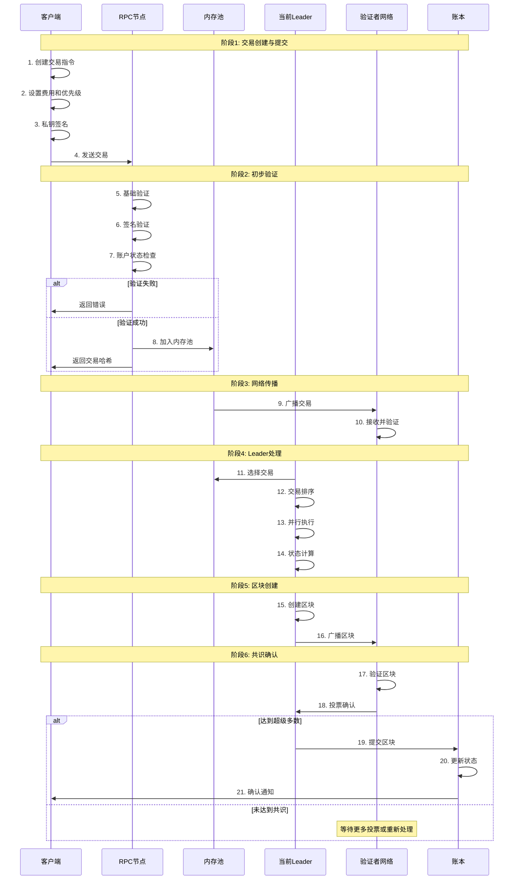

### 2.3 并行执行详细流程

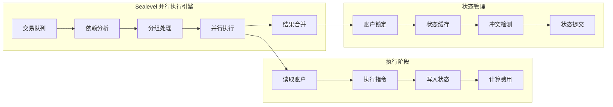

---

## 3. 各阶段详细说明

### 3.1 阶段1: 交易创建与签名

#### 3.1.1 交易结构
```rust
pub struct Transaction {
    pub signatures: Vec<Signature>,
    pub message: Message,
}

pub struct Message {
    pub header: MessageHeader,
    pub account_keys: Vec<Pubkey>,
    pub recent_blockhash: Hash,
    pub instructions: Vec<CompiledInstruction>,
}
```

#### 3.1.2 创建流程
1. **指令构建**: 定义要执行的程序和参数
2. **账户列表**: 指定涉及的账户地址
3. **费用设置**: 计算并设置交易费用
4. **签名过程**: 使用私钥对交易进行签名

### 3.2 阶段2: RPC节点验证

#### 3.2.1 验证项目
- **格式验证**: 检查交易格式是否正确
- **签名验证**: 验证所有必需的签名
- **账户验证**: 检查账户是否存在且有足够余额
- **程序验证**: 确认调用的程序是否有效

#### 3.2.2 内存池管理
```rust
pub struct MemPool {
    transactions: HashMap<Signature, Transaction>,
    priority_queue: BinaryHeap<PrioritizedTransaction>,
    capacity: usize,
}
```

### 3.3 阶段3: Leader选择与执行

#### 3.3.1 Leader轮换机制
- **时间片**: 每个Leader有固定的时间片
- **轮换顺序**: 基于质押权重的确定性轮换
- **故障转移**: 自动处理Leader故障

#### 3.3.2 并行执行引擎 (Sealevel)
```rust
pub struct SealevelRuntime {
    accounts: AccountsDB,
    programs: ProgramCache,
    executor: ParallelExecutor,
}
```

### 3.4 阶段4: 共识与确认

#### 3.4.1 投票机制
- **验证者投票**: 对区块进行投票
- **权重计算**: 基于质押量的投票权重
- **超级多数**: 需要67%以上的质押权重同意

#### 3.4.2 确认级别
- **Processed**: 交易已被处理但未确认
- **Confirmed**: 获得超级多数投票确认
- **Finalized**: 不可逆转的最终确认

---

## 4. 关键组件分析

### 4.1 Proof of History (PoH)

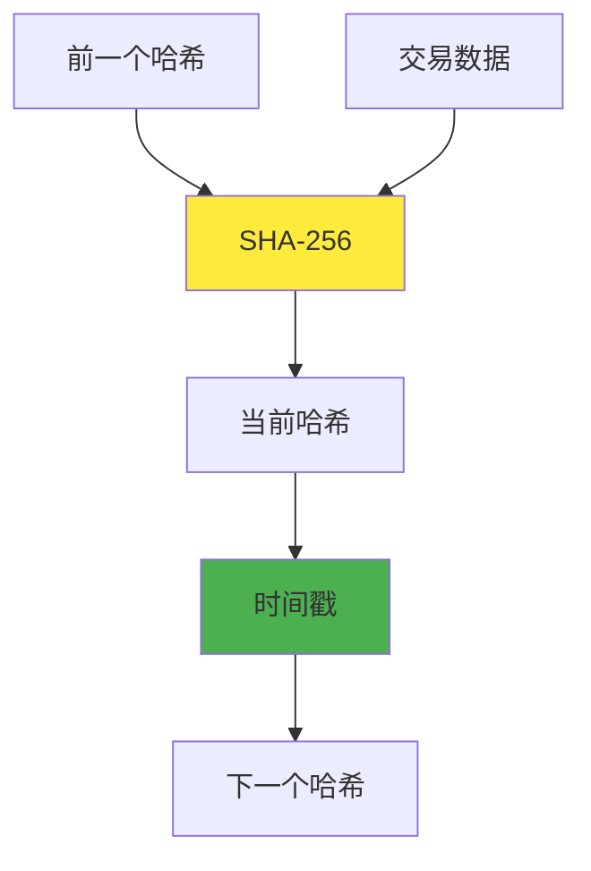

#### 4.1.1 PoH特点
- **时间排序**: 为交易提供全局时间顺序
- **并行验证**: 验证者可以并行验证历史
- **高效共识**: 减少共识所需的通信

### 4.2 账户模型

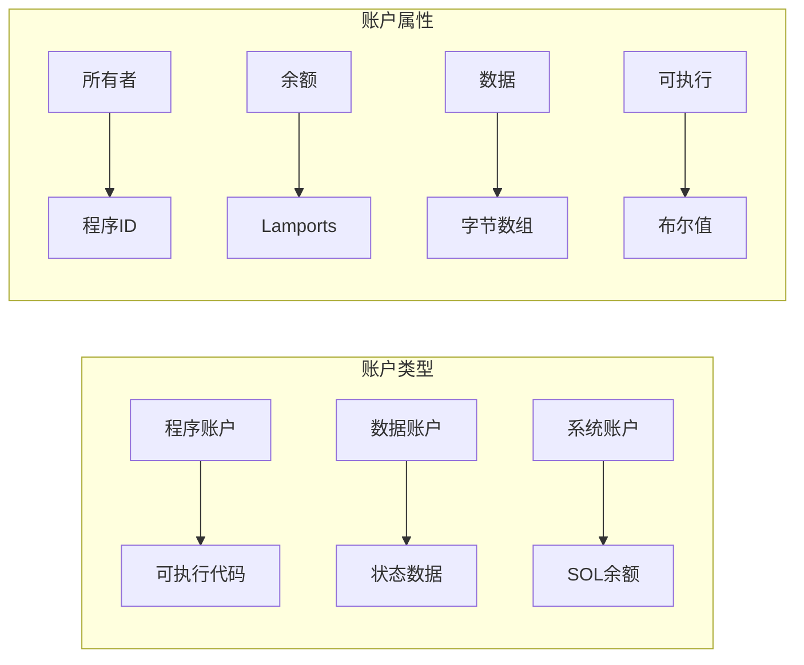

### 4.2.1 账户存储模型对比（Solana vs EVM）

#### 核心架构对比

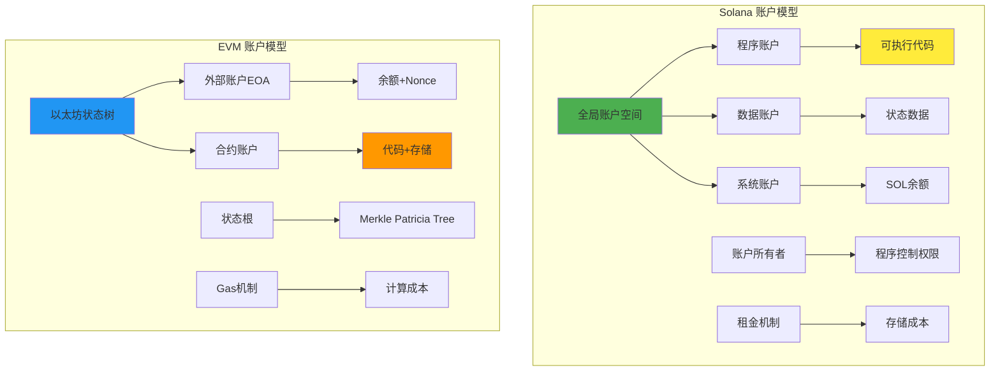

#### 详细特性对比表

| 特性维度 | Solana | EVM (以太坊) |
|---------|--------|-------------|
| **存储架构** | 扁平化账户空间 | 层次化状态树 |
| **代码存储** | 程序账户独立存储 | 合约账户内嵌代码 |
| **状态管理** | 账户拥有独立状态 | 合约内部存储槽 |
| **并行性** | 天然支持并行访问 | 需要状态锁定机制 |
| **存储成本** | 租金模型 | Gas费用模型 |
| **可升级性** | 支持程序升级 | 需要代理模式 |
| **跨程序调用** | CPI (Cross Program Invocation) | 外部调用 (External Call) |

#### 存储机制深度对比

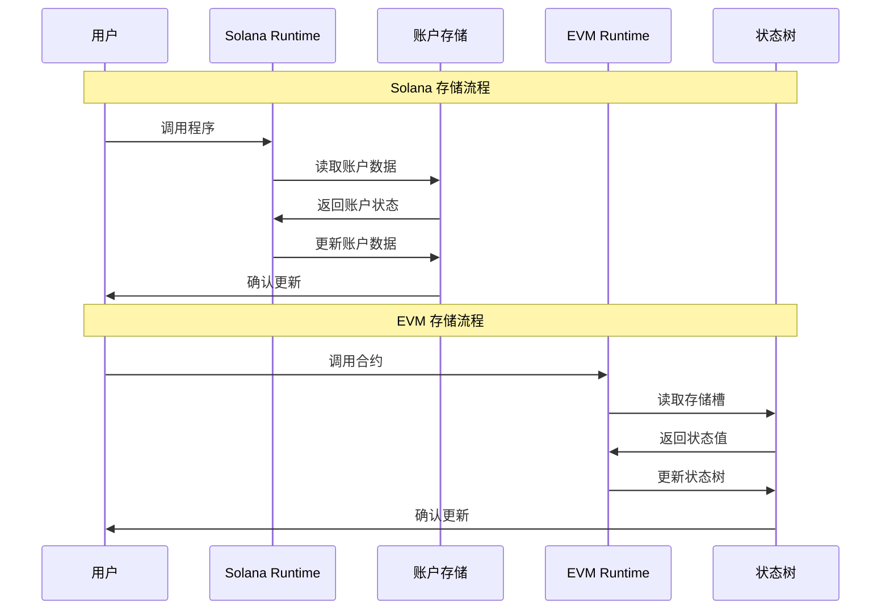

#### Solana账户模型优势

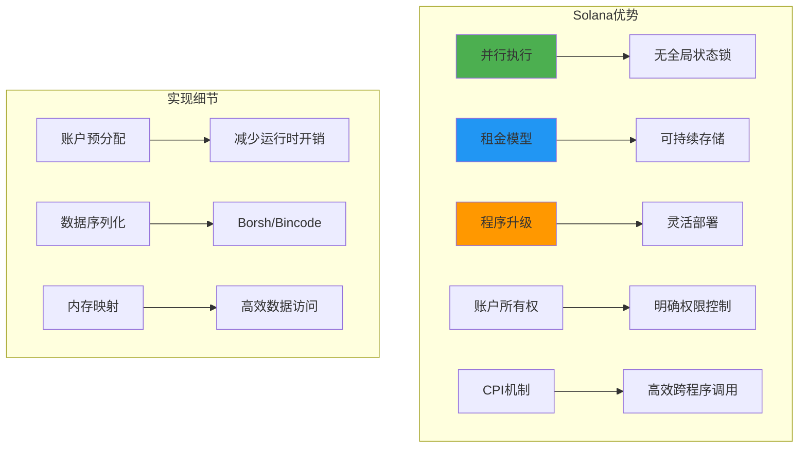

#### EVM账户模型特点

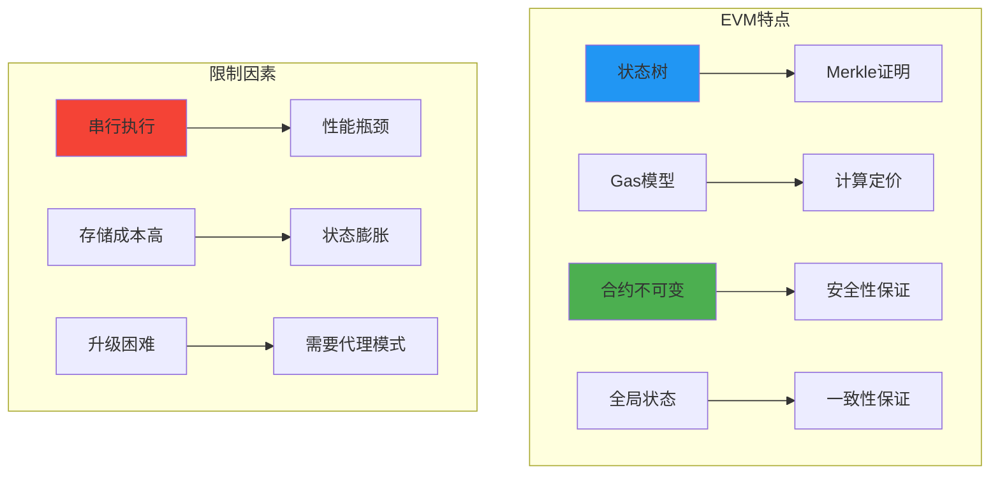

#### 代码实现对比

**Solana账户结构**
```rust
// Solana账户定义
#[derive(Debug, Clone, PartialEq)]
pub struct Account {
    pub lamports: u64,           // 账户余额
    pub data: Vec<u8>,          // 账户数据
    pub owner: Pubkey,          // 账户所有者
    pub executable: bool,        // 是否可执行
    pub rent_epoch: Epoch,      // 租金周期
}

// 程序数据账户示例
#[account]
pub struct UserProfile {
    pub authority: Pubkey,
    pub name: String,
    pub email: String,
    pub created_at: i64,
    pub updated_at: i64,
}

// 账户访问示例
#[derive(Accounts)]
pub struct UpdateProfile<'info> {
    #[account(
        mut,
        has_one = authority,
        constraint = profile.authority == authority.key()
    )]
    pub profile: Account<'info, UserProfile>,
    pub authority: Signer<'info>,
    pub system_program: Program<'info, System>,
}
```

**EVM合约存储**
```solidity
// EVM合约存储示例
contract UserRegistry {
    // 存储槽映射
    mapping(address => UserProfile) public profiles;
    mapping(address => bool) public isRegistered;
    
    struct UserProfile {
        string name;
        string email;
        uint256 createdAt;
        uint256 updatedAt;
    }
    
    // 状态修改函数
    function updateProfile(
        string memory _name,
        string memory _email
    ) public {
        require(isRegistered[msg.sender], "User not registered");
        
        profiles[msg.sender].name = _name;
        profiles[msg.sender].email = _email;
        profiles[msg.sender].updatedAt = block.timestamp;
    }
    
    // 状态读取函数
    function getProfile(address _user) 
        public 
        view 
        returns (UserProfile memory) 
    {
        return profiles[_user];
    }
}
```

#### 性能对比分析

```go
// Solana并行处理示例
type TransactionBatch struct {
    Transactions []solana.Transaction
    AccountLocks map[solana.PublicKey]bool
}

func (tb *TransactionBatch) CanExecuteInParallel() bool {
    accountAccess := make(map[solana.PublicKey]int)
    
    // 分析账户访问模式
    for _, tx := range tb.Transactions {
        for _, accountKey := range tx.Message.AccountKeys {
            accountAccess[accountKey]++
        }
    }
    
    // 检查是否有账户冲突
    for _, count := range accountAccess {
        if count > 1 {
            return false // 有账户冲突，不能并行
        }
    }
    
    return true // 可以并行执行
}

// EVM串行处理限制
type EVMTransaction struct {
    From     common.Address
    To       common.Address
    Data     []byte
    GasLimit uint64
}

func ProcessEVMTransactions(txs []EVMTransaction) {
    // EVM必须串行处理，因为每个交易都可能修改全局状态
    for _, tx := range txs {
        // 1. 加载当前状态
        state := LoadGlobalState()
        
        // 2. 执行交易
        result := ExecuteTransaction(state, tx)
        
        // 3. 更新全局状态
        UpdateGlobalState(result.NewState)
        
        // 4. 计算状态根
        newStateRoot := CalculateStateRoot(result.NewState)
        
        // 无法并行，因为每个交易都依赖前一个交易的结果
    }
}
```

#### 存储成本对比

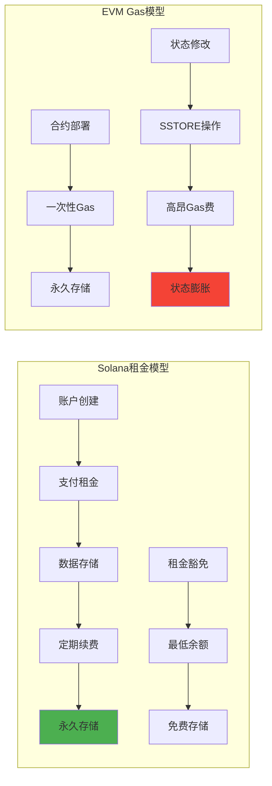

#### 开发体验对比

**Solana开发流程**
```bash
# 1. 创建新项目
anchor init my-solana-project
cd my-solana-project

# 2. 定义程序和账户
# programs/my-solana-project/src/lib.rs
# 定义指令和账户结构

# 3. 构建和部署
anchor build
anchor deploy

# 4. 测试
anchor test
```

**EVM开发流程**
```bash
# 1. 创建新项目
npx hardhat init
cd my-evm-project

# 2. 编写合约
# contracts/MyContract.sol

# 3. 编译和部署
npx hardhat compile
npx hardhat run scripts/deploy.js

# 4. 测试
npx hardhat test
```

#### 总结对比

| 方面 | Solana | EVM |
|------|--------|-----|
| **性能** | 高并发，低延迟 | 串行执行，较高延迟 |
| **可扩展性** | 水平扩展友好 | 垂直扩展依赖 |
| **开发复杂度** | 账户模型学习曲线 | 相对简单直观 |
| **生态成熟度** | 快速发展中 | 成熟稳定 |
| **存储效率** | 租金模型，高效 | Gas模型，成本较高 |
| **安全模型** | 账户权限控制 | 合约不可变性 |

这种对比帮助开发者理解两种不同架构的优劣，选择最适合项目需求的平台。

### 4.3 费用机制

#### 4.3.1 费用计算
```rust
pub fn calculate_fee(
    message: &Message,
    lamports_per_signature: u64,
) -> u64 {
    let signatures_count = message.header.num_required_signatures as u64;
    signatures_count * lamports_per_signature
}
```

#### 4.3.2 优先级费用
- **基础费用**: 每个签名的固定费用
- **优先级费用**: 可选的额外费用以提高处理优先级
- **计算单元费用**: 基于计算复杂度的费用

### 4.4 BPF加载器工作原理

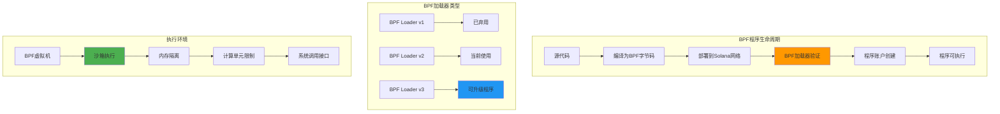

#### 4.4.1 BPF加载器架构

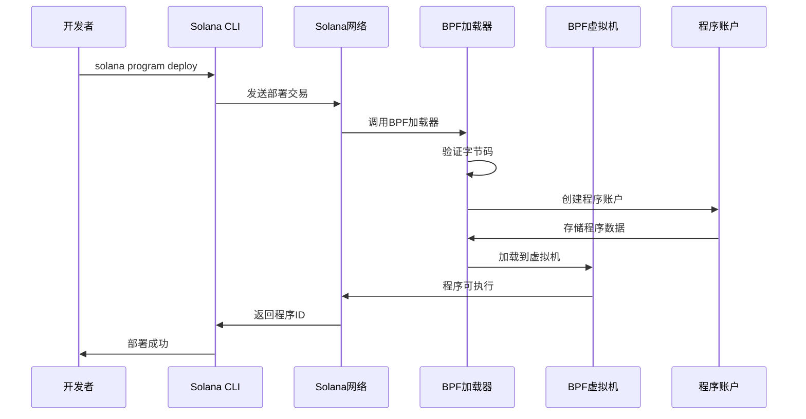

#### 4.4.2 BPF程序验证流程

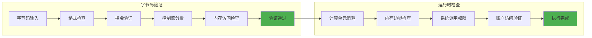

#### 4.4.3 BPF加载器实现细节

```go
// BPF程序部署示例
type BPFProgram struct {
    ProgramID   solana.PublicKey
    Bytecode    []byte
    LoaderType  LoaderType
    Upgradeable bool
}

type LoaderType int

const (
    BPFLoaderV1 LoaderType = iota
    BPFLoaderV2
    BPFLoaderV3Upgradeable
)

// 部署BPF程序
func DeployBPFProgram(
    client *rpc.Client,
    payer *solana.PrivateKey,
    program *BPFProgram,
) (*solana.PublicKey, error) {
    
    // 1. 创建程序账户
    programAccount := solana.NewWallet()
    
    // 2. 计算所需空间
    dataLen := len(program.Bytecode)
    rent, err := client.GetMinimumBalanceForRentExemption(
        context.TODO(),
        uint64(dataLen),
        rpc.CommitmentFinalized,
    )
    if err != nil {
        return nil, err
    }
    
    // 3. 创建账户指令
    createAccountIx := system.NewCreateAccountInstruction(
        rent,
        uint64(dataLen),
        GetLoaderProgramID(program.LoaderType),
        payer.PublicKey(),
        programAccount.PublicKey(),
    ).Build()
    
    // 4. 写入程序数据指令
    var writeInstructions []solana.Instruction
    chunkSize := 1024 // 每次写入1KB
    
    for offset := 0; offset < len(program.Bytecode); offset += chunkSize {
        end := offset + chunkSize
        if end > len(program.Bytecode) {
            end = len(program.Bytecode)
        }
        
        writeIx := NewWriteInstruction(
            programAccount.PublicKey(),
            uint32(offset),
            program.Bytecode[offset:end],
            program.LoaderType,
        )
        writeInstructions = append(writeInstructions, writeIx)
    }
    
    // 5. 最终化程序指令
    finalizeIx := NewFinalizeInstruction(
        programAccount.PublicKey(),
        program.LoaderType,
    )
    
    // 6. 构建并发送交易
    instructions := []solana.Instruction{createAccountIx}
    instructions = append(instructions, writeInstructions...)
    instructions = append(instructions, finalizeIx)
    
    return executeInstructions(client, payer, instructions, programAccount)
}

// 获取加载器程序ID
func GetLoaderProgramID(loaderType LoaderType) solana.PublicKey {
    switch loaderType {
    case BPFLoaderV1:
        return solana.MustPublicKeyFromBase58("BPFLoader1111111111111111111111111111111111")
    case BPFLoaderV2:
        return solana.MustPublicKeyFromBase58("BPFLoader2111111111111111111111111111111111")
    case BPFLoaderV3Upgradeable:
        return solana.MustPublicKeyFromBase58("BPFLoaderUpgradeab1e11111111111111111111111")
    default:
        panic("未知的加载器类型")
    }
}
```

#### 4.4.4 BPF虚拟机特性

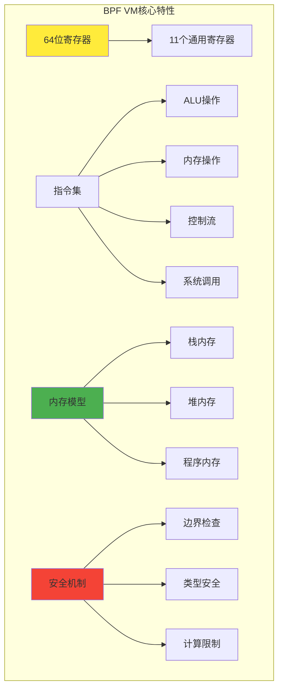

#### 4.4.5 系统调用接口

```rust
// Solana BPF系统调用示例
pub enum SyscallType {
    // 日志输出
    Log,
    LogU64,
    LogData,
    
    // 加密操作
    Sha256,
    Keccak256,
    Blake3,
    
    // 账户操作
    CreateAccount,
    AssignAccount,
    TransferLamports,
    
    // 程序调用
    InvokeSignedC,
    InvokeSigned,
    
    // 时间和随机数
    GetClockSysvar,
    GetEpochScheduleSysvar,
    GetRentSysvar,
}

// 系统调用处理流程
impl BPFVirtualMachine {
    fn handle_syscall(&mut self, syscall_id: u64, args: &[u64]) -> Result<u64, BPFError> {
        match syscall_id {
            0x01 => self.sol_log(args),
            0x02 => self.sol_log_u64(args),
            0x03 => self.sol_sha256(args),
            0x04 => self.sol_keccak256(args),
            0x05 => self.sol_invoke_signed_c(args),
            _ => Err(BPFError::InvalidSyscall),
        }
    }
    
    fn sol_log(&mut self, args: &[u64]) -> Result<u64, BPFError> {
        let message_ptr = args[0];
        let message_len = args[1];
        
        // 验证内存访问
        self.check_memory_access(message_ptr, message_len)?;
        
        // 读取消息
        let message = self.read_memory(message_ptr, message_len)?;
        
        // 输出日志
        println!("Program log: {}", String::from_utf8_lossy(&message));
        
        Ok(0)
    }
}

---

## 5. 代码实现示例

### 5.1 创建和发送交易

```go
package main

import (
    "context"
    "fmt"
    "github.com/gagliardetto/solana-go"
    "github.com/gagliardetto/solana-go/rpc"
    "github.com/gagliardetto/solana-go/programs/system"
)

func createAndSendTransaction() error {
    // 1. 创建RPC客户端
    client := rpc.New("https://api.mainnet-beta.solana.com")
    
    // 2. 创建发送者和接收者账户
    sender := solana.MustPrivateKeyFromBase58("your_private_key")
    receiver := solana.MustPublicKeyFromBase58("receiver_address")
    
    // 3. 获取最新区块哈希
    recent, err := client.GetRecentBlockhash(context.TODO(), rpc.CommitmentFinalized)
    if err != nil {
        return err
    }
    
    // 4. 创建转账指令
    instruction := system.NewTransferInstruction(
        1000000, // 0.001 SOL (in lamports)
        sender.PublicKey(),
        receiver,
    ).Build()
    
    // 5. 创建交易
    tx, err := solana.NewTransaction(
        []solana.Instruction{instruction},
        recent.Value.Blockhash,
        solana.TransactionPayer(sender.PublicKey()),
    )
    if err != nil {
        return err
    }
    
    // 6. 签名交易
    _, err = tx.Sign(func(key solana.PublicKey) *solana.PrivateKey {
        if key.Equals(sender.PublicKey()) {
            return &sender
        }
        return nil
    })
    if err != nil {
        return err
    }
    
    // 7. 发送交易
    sig, err := client.SendTransaction(context.TODO(), tx)
    if err != nil {
        return err
    }
    
    fmt.Printf("Transaction sent: %s\n", sig)
    
    // 8. 等待确认
    return waitForConfirmation(client, sig)
}

func waitForConfirmation(client *rpc.Client, signature solana.Signature) error {
    for {
        status, err := client.GetSignatureStatus(
            context.TODO(),
            signature,
            &rpc.GetSignatureStatusConfig{
                SearchTransactionHistory: true,
            },
        )
        if err != nil {
            return err
        }
        
        if status != nil && status.ConfirmationStatus != nil {
            switch *status.ConfirmationStatus {
            case rpc.ConfirmationStatusProcessed:
                fmt.Println("Transaction processed")
            case rpc.ConfirmationStatusConfirmed:
                fmt.Println("Transaction confirmed")
            case rpc.ConfirmationStatusFinalized:
                fmt.Println("Transaction finalized")
                return nil
            }
        }
        
        time.Sleep(1 * time.Second)
    }
}
```

### 5.2 监听交易状态

```go
func monitorTransaction(client *rpc.Client, signature solana.Signature) {
    // 使用WebSocket监听交易状态
    wsClient, err := ws.Connect(context.Background(), "wss://api.mainnet-beta.solana.com")
    if err != nil {
        log.Fatal(err)
    }
    defer wsClient.Close()
    
    // 订阅签名状态
    sub, err := wsClient.SignatureSubscribe(
        signature,
        rpc.CommitmentFinalized,
    )
    if err != nil {
        log.Fatal(err)
    }
    defer sub.Unsubscribe()
    
    for {
        got, err := sub.Recv()
        if err != nil {
            log.Fatal(err)
        }
        
        fmt.Printf("Transaction status update: %+v\n", got)
        
        if got.Value.Err != nil {
            fmt.Printf("Transaction failed: %v\n", got.Value.Err)
            break
        }
        
        // 检查确认状态
        if got.Value.ConfirmationStatus != nil {
            fmt.Printf("Confirmation status: %s\n", *got.Value.ConfirmationStatus)
            if *got.Value.ConfirmationStatus == rpc.ConfirmationStatusFinalized {
                fmt.Println("Transaction finalized!")
                break
            }
        }
    }
}
```

### 5.3 批量交易处理

```go
func processBatchTransactions(client *rpc.Client, transactions []solana.Transaction) error {
    // 1. 并发发送交易
    signatures := make([]solana.Signature, len(transactions))
    errChan := make(chan error, len(transactions))
    
    for i, tx := range transactions {
        go func(index int, transaction solana.Transaction) {
            sig, err := client.SendTransaction(context.TODO(), &transaction)
            if err != nil {
                errChan <- err
                return
            }
            signatures[index] = sig
            errChan <- nil
        }(i, tx)
    }
    
    // 2. 等待所有交易发送完成
    for i := 0; i < len(transactions); i++ {
        if err := <-errChan; err != nil {
            return fmt.Errorf("failed to send transaction %d: %w", i, err)
        }
    }
    
    // 3. 批量检查确认状态
    return waitForBatchConfirmation(client, signatures)
}

func waitForBatchConfirmation(client *rpc.Client, signatures []solana.Signature) error {
    confirmed := make([]bool, len(signatures))
    
    for {
        allConfirmed := true
        
        for i, sig := range signatures {
            if confirmed[i] {
                continue
            }
            
            status, err := client.GetSignatureStatus(context.TODO(), sig, nil)
            if err != nil {
                continue
            }
            
            if status != nil && status.ConfirmationStatus != nil {
                if *status.ConfirmationStatus == rpc.ConfirmationStatusFinalized {
                    confirmed[i] = true
                    fmt.Printf("Transaction %d finalized: %s\n", i, sig)
                } else {
                    allConfirmed = false
                }
            } else {
                allConfirmed = false
            }
        }
        
        if allConfirmed {
            fmt.Println("All transactions confirmed!")
            break
        }
        
        time.Sleep(2 * time.Second)
    }
    
    return nil
}
```

---

## 6. 性能优化建议

### 6.1 交易优化
- **批量处理**: 将多个操作合并到单个交易中
- **优先级费用**: 在网络拥堵时使用优先级费用
- **计算单元优化**: 优化程序逻辑以减少计算单元消耗

### 6.2 网络优化
- **RPC节点选择**: 选择延迟最低的RPC节点
- **连接池**: 使用连接池管理RPC连接
- **重试机制**: 实现智能重试机制

### 6.3 监控和调试
- **交易日志**: 记录详细的交易日志
- **性能指标**: 监控交易处理时间和成功率
- **错误处理**: 实现完善的错误处理机制

---

## 总结

Solana的交易生命周期体现了其高性能区块链的设计理念：
1. **并行处理**: 通过Sealevel实现真正的并行执行
2. **确定性排序**: PoH提供全局时间顺序
3. **快速确认**: 优化的共识机制实现快速确认
4. **可扩展性**: 支持高吞吐量的交易处理

理解这个生命周期对于开发高效的Solana应用程序至关重要。