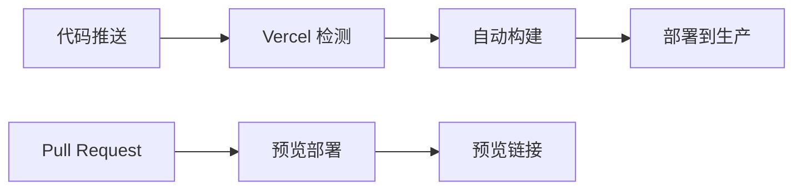

# Vercel 部署详细指南

本指南将详细介绍如何将个人博客系统部署到 Vercel 平台。

## 🌟 Vercel 简介

Vercel 是一个专为前端框架优化的云平台，特别适合 Next.js 应用的部署。它提供：
- 全球 CDN 加速
- 自动 HTTPS
- 无服务器函数
- 自动化部署
- 预览部署
- 性能监控

## 📋 部署前准备

### 1. 确保项目准备就绪
- [ ] 项目代码已提交到 Git 仓库
- [ ] 本地开发环境运行正常
- [ ] 环境变量配置完整
- [ ] 构建命令测试通过

### 2. 检查项目配置
```bash
# 确保构建成功
npm run build

# 确保生产模式启动正常
npm run start
```

## 🚀 第一步：注册 Vercel 账号

### 1.1 访问 Vercel 官网
1. 打开浏览器，访问 [https://vercel.com](https://vercel.com)
2. 点击右上角的 "Sign Up" 按钮

### 1.2 选择注册方式
**推荐使用 GitHub 登录：**
1. 点击 "Continue with GitHub"
2. 授权 Vercel 访问你的 GitHub 账户
3. 完成注册流程

**其他注册方式：**
- GitLab
- Bitbucket
- 邮箱注册

## 📦 第二步：导入项目

### 2.1 连接 Git 仓库
1. 登录 Vercel 控制台
2. 点击 "New Project" 按钮
3. 选择 "Import Git Repository"
4. 选择你的个人博客项目仓库

### 2.2 项目配置
```javascript
// 项目配置示例
{
  "name": "personal-blog",
  "framework": "nextjs",
  "buildCommand": "npm run build",
  "outputDirectory": ".next",
  "installCommand": "npm install",
  "devCommand": "npm run dev"
}
```

### 2.3 构建设置
- **Framework Preset**: Next.js
- **Root Directory**: `./` (项目根目录)
- **Build Command**: `npm run build` (通常自动检测)
- **Output Directory**: `.next` (通常自动检测)
- **Install Command**: `npm install` (通常自动检测)

## 🔧 第三步：环境变量配置

### 3.1 自动化环境变量配置 (推荐)

#### 方法一：使用 .env.local 文件自动同步
由于项目已配置 `.env.local` 文件可提交到 Git，Vercel 会自动读取：

1. **确保 .env.local 文件已提交**：
```bash
# 检查文件是否被 Git 跟踪
git status
git add .env.local
git commit -m "Add environment variables"
git push
```

2. **Vercel 自动检测**：
   - Vercel 会自动读取项目根目录的 `.env.local` 文件
   - 无需手动在控制台配置环境变量
   - 支持所有 `NEXT_PUBLIC_` 开头的变量

#### 方法二：使用 Vercel CLI 批量导入
```bash
# 安装 Vercel CLI
npm i -g vercel

# 登录 Vercel
vercel login

# 导入环境变量
vercel env pull .env.local
vercel env add < .env.local
```

#### 方法三：使用 GitHub Actions 自动同步
创建 `.github/workflows/deploy.yml`：
```yaml
name: Deploy to Vercel
on:
  push:
    branches: [main]
jobs:
  deploy:
    runs-on: ubuntu-latest
    steps:
      - uses: actions/checkout@v2
      - name: Deploy to Vercel
        uses: amondnet/vercel-action@v20
        with:
          vercel-token: ${{ secrets.VERCEL_TOKEN }}
          vercel-org-id: ${{ secrets.ORG_ID }}
          vercel-project-id: ${{ secrets.PROJECT_ID }}
```

### 3.2 手动配置环境变量 (备选方案)
如果需要手动配置，在项目设置页面添加：

```env
# Supabase 配置
NEXT_PUBLIC_SUPABASE_URL=https://your-project-id.supabase.co
NEXT_PUBLIC_SUPABASE_ANON_KEY=your_anon_key_here
SUPABASE_SERVICE_ROLE_KEY=your_service_role_key_here

# 网站配置
NEXT_PUBLIC_SITE_URL=https://your-domain.vercel.app

# 管理员配置
ADMIN_EMAIL=your-email@example.com

# 其他可选配置
NEXT_PUBLIC_ANALYTICS_ID=your_analytics_id
NEXT_PUBLIC_SENTRY_DSN=your_sentry_dsn
```

### 3.2 环境变量类型
- **Production**: 生产环境变量
- **Preview**: 预览环境变量
- **Development**: 开发环境变量

**重要提示：**
- 敏感信息（如 Service Role Key）只添加到 Production
- 公开变量（以 NEXT_PUBLIC_ 开头）可以添加到所有环境

## 🔄 第四步：自动化部署流程

### 4.1 Git 集成部署
Vercel 会自动监听你的 Git 仓库变化：



### 4.2 部署触发条件
- **生产部署**: 推送到 `main` 或 `master` 分支
- **预览部署**: 创建 Pull Request 或推送到其他分支

### 4.3 部署配置文件 (可选)
创建 `vercel.json` 文件进行高级配置：

```json
{
  "version": 2,
  "builds": [
    {
      "src": "package.json",
      "use": "@vercel/next"
    }
  ],
  "routes": [
    {
      "src": "/api/(.*)",
      "dest": "/api/$1"
    },
    {
      "src": "/(.*)",
      "dest": "/$1"
    }
  ],
  "env": {
    "NODE_ENV": "production"
  },
  "functions": {
    "src/app/api/**/*.ts": {
      "maxDuration": 30
    }
  }
}
```

## 🌐 第五步：域名配置

### 5.1 使用 Vercel 默认域名
部署成功后，你会获得一个默认域名：
- 格式：`https://your-project-name.vercel.app`
- 自动 HTTPS
- 全球 CDN 加速

### 5.2 配置自定义域名

#### 购买域名
1. 从域名注册商购买域名（如 Namecheap、GoDaddy、阿里云等）
2. 获得域名管理权限

#### 在 Vercel 中添加域名
1. 进入项目设置页面
2. 点击 "Domains" 选项卡
3. 点击 "Add" 按钮
4. 输入你的域名（如 `myblog.com`）
5. 点击 "Add"

#### 配置 DNS 记录
在你的域名注册商处添加以下 DNS 记录：

**方式一：CNAME 记录（推荐）**
```
类型: CNAME
名称: www
值: cname.vercel-dns.com
```

**方式二：A 记录**
```
类型: A
名称: @
值: 76.76.19.61
```

**子域名配置**
```
类型: CNAME
名称: blog
值: cname.vercel-dns.com
```

### 5.3 SSL 证书
Vercel 会自动为你的域名申请和配置 SSL 证书：
- 自动续期
- 支持通配符证书
- Let's Encrypt 证书

## 📊 第六步：部署监控和优化

### 6.1 部署状态监控
在 Vercel 控制台可以查看：
- 部署历史
- 构建日志
- 部署时间
- 错误信息

### 6.2 性能监控
Vercel 提供内置的性能监控：
- **Real Experience Score**: 真实用户体验评分
- **Core Web Vitals**: 核心网页指标
- **Function Logs**: 无服务器函数日志

### 6.3 Analytics 集成
```javascript
// next.config.js
module.exports = {
  experimental: {
    // 启用 Vercel Analytics
    instrumentationHook: true,
  },
  // 启用 Vercel Speed Insights
  experimental: {
    webVitalsAttribution: ['CLS', 'LCP']
  }
}
```

## 🔧 第七步：高级配置

### 7.1 预览部署配置
```json
// vercel.json
{
  "github": {
    "silent": true,
    "autoAlias": false
  },
  "preview": {
    "alias": ["preview-myblog.vercel.app"]
  }
}
```

### 7.2 重定向配置
```json
{
  "redirects": [
    {
      "source": "/old-blog/:path*",
      "destination": "/articles/:path*",
      "permanent": true
    },
    {
      "source": "/admin",
      "destination": "/admin/dashboard",
      "permanent": false
    }
  ]
}
```

### 7.3 Header 配置
```json
{
  "headers": [
    {
      "source": "/(.*)",
      "headers": [
        {
          "key": "X-Content-Type-Options",
          "value": "nosniff"
        },
        {
          "key": "X-Frame-Options",
          "value": "DENY"
        },
        {
          "key": "X-XSS-Protection",
          "value": "1; mode=block"
        }
      ]
    }
  ]
}
```

## 🚨 常见问题和解决方案

### 问题 1：构建失败
**可能原因：**
- 依赖安装失败
- TypeScript 类型错误
- 环境变量缺失

**解决方案：**
```bash
# 本地测试构建
npm run build

# 检查依赖
npm audit

# 修复类型错误
npm run type-check
```

### 问题 2：环境变量不生效
**可能原因：**
- 变量名拼写错误
- 环境类型选择错误
- 缓存问题

**解决方案：**
1. 检查变量名和值
2. 确认环境类型设置
3. 重新部署项目

### 问题 3：域名解析失败
**可能原因：**
- DNS 记录配置错误
- DNS 传播延迟
- 域名状态异常

**解决方案：**
```bash
# 检查 DNS 解析
nslookup your-domain.com

# 检查 CNAME 记录
dig CNAME www.your-domain.com
```

### 问题 4：API 路由 404 错误
**可能原因：**
- 路由文件位置错误
- 导出格式不正确
- 中间件配置问题

**解决方案：**
```javascript
// 确保 API 路由正确导出
// src/app/api/articles/route.ts
export async function GET(request: Request) {
  // 处理逻辑
}

export async function POST(request: Request) {
  // 处理逻辑
}
```

## 📈 性能优化建议

### 1. 图片优化
```javascript
// next.config.js
module.exports = {
  images: {
    domains: ['your-supabase-url.supabase.co'],
    formats: ['image/webp', 'image/avif'],
    minimumCacheTTL: 60,
  },
}
```

### 2. 缓存策略
```javascript
// 静态资源缓存
export const revalidate = 3600; // 1小时

// API 路由缓存
export async function GET() {
  return NextResponse.json(data, {
    headers: {
      'Cache-Control': 'public, s-maxage=60, stale-while-revalidate=300'
    }
  });
}
```

### 3. 代码分割
```javascript
// 动态导入
const AdminPanel = dynamic(() => import('../components/AdminPanel'), {
  loading: () => <p>Loading...</p>,
  ssr: false
});
```

## 🔄 CI/CD 工作流程

### GitHub Actions 集成 (可选)
```yaml
# .github/workflows/deploy.yml
name: Deploy to Vercel

on:
  push:
    branches: [main]
  pull_request:
    branches: [main]

jobs:
  deploy:
    runs-on: ubuntu-latest
    steps:
      - uses: actions/checkout@v2
      
      - name: Setup Node.js
        uses: actions/setup-node@v2
        with:
          node-version: '18'
          
      - name: Install dependencies
        run: npm ci
        
      - name: Run tests
        run: npm test
        
      - name: Build project
        run: npm run build
        
      - name: Deploy to Vercel
        uses: amondnet/vercel-action@v20
        with:
          vercel-token: ${{ secrets.VERCEL_TOKEN }}
          vercel-org-id: ${{ secrets.ORG_ID }}
          vercel-project-id: ${{ secrets.PROJECT_ID }}
```

## 📚 有用的资源

### 官方文档
- [Vercel 官方文档](https://vercel.com/docs)
- [Next.js 部署指南](https://nextjs.org/docs/deployment)
- [Vercel CLI 文档](https://vercel.com/docs/cli)

### 社区资源
- [Vercel 社区论坛](https://github.com/vercel/vercel/discussions)
- [Next.js Discord](https://discord.gg/nextjs)
- [Vercel Examples](https://github.com/vercel/examples)

### 工具和插件
- [Vercel CLI](https://vercel.com/cli) - 命令行工具
- [Vercel for VS Code](https://marketplace.visualstudio.com/items?itemName=vercel.vercel-vscode) - VS Code 插件
- [Vercel Analytics](https://vercel.com/analytics) - 性能分析

## ✅ 部署检查清单

### 部署前检查
- [ ] 代码已推送到 Git 仓库
- [ ] 本地构建测试通过
- [ ] 环境变量配置完整
- [ ] 数据库连接测试正常
- [ ] API 路由功能正常

### 部署后验证
- [ ] 网站可以正常访问
- [ ] 所有页面加载正常
- [ ] API 接口响应正常
- [ ] 数据库操作正常
- [ ] 图片和静态资源加载正常
- [ ] SEO 标签正确显示
- [ ] 性能指标达标

### 监控设置
- [ ] 错误监控配置
- [ ] 性能监控启用
- [ ] 日志记录正常
- [ ] 备份策略确认

---

## 🎉 恭喜！

完成以上步骤后，你的个人博客系统就成功部署到 Vercel 了！你现在拥有：

- ✅ 全球 CDN 加速的网站
- ✅ 自动 HTTPS 安全连接
- ✅ 自动化部署流程
- ✅ 预览部署功能
- ✅ 性能监控和分析
- ✅ 可扩展的无服务器架构

记住定期检查部署状态和性能指标，确保网站始终保持最佳状态！

**Happy Deploying! 🚀**